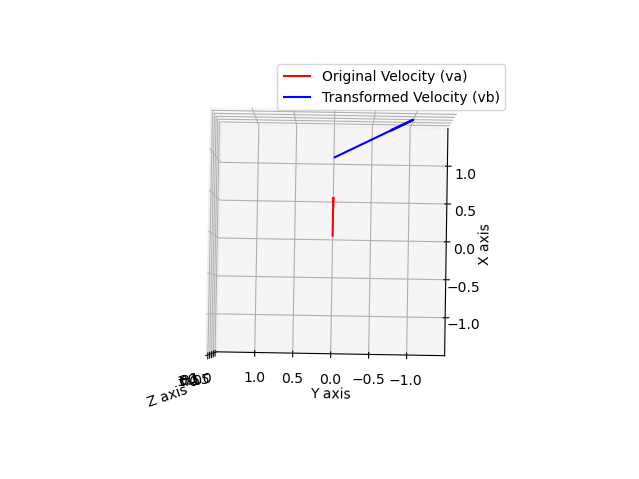

# Transfrom Velocity

## Summary
transfrom_velocity is a C++ library for performing 3D and 2D velocity transformations.

## How to build 

~~~
mkdir build
cd build
cmake ..
make
~~~

## Execution Method

~~~
./transfrom_velocity_main
~~~

visualization

~~~
python3 ../script/visualize_velocity_transformation.py
~~~

~~~
Tba
[[1. 0. 0. 1.]
 [0. 1. 0. 0.]
 [0. 0. 1. 0.]
 [0. 0. 0. 1.]]

v = (vx vy vz wx wy wz)
va
[0.5 0.  0.  0.  0.  1. ]
vb
[ 0.5 -1.   0.   0.   0.   1. ]
~~~

## 参考

[Crash Course for Robot Engineers (3): Rigid Body Transformation of Translational and Angular Velocity(in Japanse)](https://qiita.com/scomup/items/304277af1dbcd7e12cc8)

[MathematicalRobotics/kinematics](https://github.com/scomup/MathematicalRobotics/tree/main/kinematics)